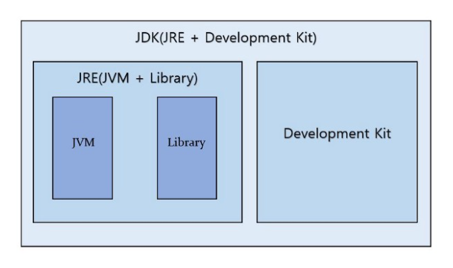

# 자바 소스 파일(.java)을 JVM으로 실행하는 과정


#### 학습할 것

[1. JVM이란 무엇인가](#JVM이란-무엇인가)

[2. 컴파일하는 방법](#컴파일하는-방법)

[3. 실행하는 방법](#실행하는-방법)

[4. 바이트코드란 무엇인가](#바이트코드란-무엇인가)

[5. JIT 컴파일러란 무엇이며 어떻게 동작하는지](#JIT-컴파일러란-무엇이며-어떻게-동작하는지)

[6. JVM 구성 요소](#JVM-구성-요소)

[7. JDK와 JRE의 차이](#JDK와-JRE의-차이)
  
---


### JVM이란 무엇인가

```
JVM은 바이트코드를 해석하고 실행하는 가상머신이다. ( Java Virtual Machine )

개발자가 한번만 프로그램을 작성하면, 모든 운영체제에서 같이 사용할 수 있다.

단, JVM은 운영체제에 종속적이므로, 각 운영체제에 맞는 JVM을 설치해야 한다
-> JVM 에 의해 자바가 플랫폼 독립적이게 된다

또한 메모리 관리, Garbage Collection 등을 수행한다
```

</img>
<br>출처 [tcp스쿨](http://tcpschool.com/java/java_intro_programming)


---


### 컴파일하는 방법
```bash
javac <options> <source files>
javac HelloWorld.java
```
```
위와 같이 컴파일하면 .class파일 생성
```

---


### 실행하는 방법
```bash
javac [file].class
```

---
### 바이트코드란 무엇인가
```
고급 언어로 작성된 소스 코드를 가상머신이 이해할 수 있는 중간 코드로 컴파일한 것.

가상머신은 바이트코드를 각각의 하드웨어 아키텍처에 맞는 기계어로 다시 컴파일함.
```

---
### JIT 컴파일러란 무엇이며 어떻게 동작하는지

* Interpreter
```
실행 엔진은 바이트 코드를 명령어 단위로 실행한다.
이는 한 줄 씩 수행하기 때문에 느리다는 단점을 가지고 있다.
```

* Just-in-time Compiler
```
Interpreter 방식의 단점을 보완하기 위해 도입된 방식으로,
Interpreter 방식으로 실행하다가 적절한 시점에 바이트 코드 전체를 컴파일 하여 네이티브 코드로 변경하고,
더 이상 Interpreting 하지 않고 네이티브 코드로 직접 실행하는 방식
네이티브 코드는 캐시에 보관되기 때문에 한 번 컴파일된 코드는 빠르게 실행할 수 있다.

물론 한 번만 실행되는 코드라면 JIT 보다 Interpreter 방식이 유리
따라서 JVM은 해당 메소드가 얼마나 자주 수행되는지 체크하고, 일정 정도를 넘을 때 컴파일을 수행한다.
```

---
### JVM 구성 요소
</img>
<br>
출처 [https://medium.com/webeveloper/jvm-java-virtual-machine-architecture-94b914e93d86](https://medium.com/webeveloper/jvm-java-virtual-machine-architecture-94b914e93d86)
<br><br>
* Class Loader
```
로딩, 링크, 초기화 순서로 진행되며 클래스 파일을 메모리에 적재하는 역할을 함

로딩 : Class Loader가 .class파일을 읽어 적절한 바이너리 데이터를 만들고 메서드 영역에 저장
      로딩이 끝나면 해당 클래스 타입의 class 객체를 생성하여 힙영역에 저장
      
링크 : 검증 - .class 파일 형식이 유효한지 체크
      준비 - 클래스가 필요로 하는 메모리 할당
      분석 - 클래스의 상수 풀 내 모든 심벌릭 래퍼런스를 다이렉트 래퍼런스로 변경

초기화 : 클래스 변수를 적절한 값으로 초기화 ( Static 변수 값 할당 )

```
* Execution Engine
```
Class Loader에 의해 Runtime Data Area 에 적재된 클래스(바이트 코드)들을 기계어로 변경해 명령어 단위로 실행
이때 명령어를 하나씩 실행하는 인터프리터 방식이 있고, 바이트 코드를 네이티브 코드로 변환하는 JIT Compiler 방식이 있다.
```
* Runtime Data Area ( Memory )
```
클래스 파일들이 적재되어있는 장소
```
* Java Native Method Interface ( JNI )
```
자바보다 빠른 C 또는 C++, 어셈블리로 작성된 함수를 JVM에서 사용할 수 있는 방법을 제공해주는 곳. 
네이티브 키워드를 사용한 메소드 호출
```

---


### JDK와 JRE의 차이
</img><br>
출처 [https://medium.com/webeveloper/jvm-java-virtual-machine-architecture-94b914e93d86](https://medium.com/webeveloper/jvm-java-virtual-machine-architecture-94b914e93d86)

* JRE
```
자바 실행환경(Java Runtime Environment)의 약자
JRE는 JVM 이 자바 프로그램을 동작시킬 때 필요한 라이브러리 파일들과 기타 파일들을 가지고 있다 (읽기)
```
* JDK
```
자바 개발도구(Java Development Kit)의 약자
JRE + 개발을 위해 필요한 도구(javac, java등)들을 가지고 있다 (읽기/쓰기)
```
