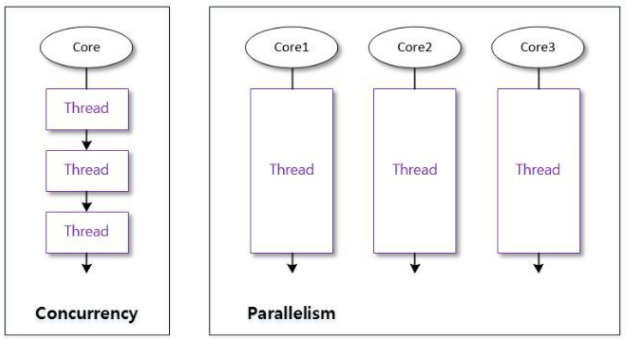

# 자바 멀티쓰레드


#### 학습할 것

[1. Thread 클래스와 Runnable 인터페이스](#Thread-클래스와-Runnable-인터페이스)

[2. 쓰레드의 상태](#쓰레드의-상태)

[3. 쓰레드의 우선순위](#쓰레드의-우선순위)

[4. Main 쓰레드](#Main-쓰레드)

[5. 동기화](#동기화)

[6. 데드락](#데드락)


---
### Thread 클래스와 Runnable 인터페이스
1. 프로세스(Process)
    - 메모리를 할당받아 실행중인 프로그램
    - Thread를 이용하면 한 프로세스 내에서 두가지 이상의 일을 동시에 할 수 있다.
    
2. 쓰레드(Thread)
    - 프로세스 내에서 실행되는 하나의 단위
    - 동시에 실행되어야 하는 개별적인 모듈
    - main()이외의 또다른 스레드를 만드려면 Thread 클래스 상속 / Runnable 인터페이스 구현
    - 동시에 여러개의 요청을 처리하여 속도를 빠르게 하기위해 사용 (멀티쓰레드)
   
3. Thread 클래스로 구현
```java
public class assingment10 {
    public static void main(String[] args) {
        //Thread Class로 쓰레드 구현
        ThreadClass t1 = new ThreadClass();

        //쓰레드 1 실행
        t1.start();// run() 메소드 호출
        
    }
}

class ThreadClass extends Thread{
    @Override
    public void run() {
        System.out.println("Thread Class 사용");
    }
}
```

4. Runnable 인터페이스로 구현
   - 상속이 가능하기 때문에 주로 사용
```java
public class assingment10 {
    public static void main(String[] args) {
        //Runnable Interface로 쓰레드 구현
        Runnable r = new RunnableInterface();
        Thread t2 = new Thread(r);

        //쓰레드 2 실행
        t2.start(); //run() 메소드 호출
    }
}

class RunnableInterface implements Runnable{

    @Override
    public void run() {
        System.out.println("Runnable Interface 사용");
    }
}
```

5. Thread 클래스 메서드
   - Thread currentThread() //현재 실행중인 쓰레드 객체의 참조 값 반환
   - String getName() //쓰레드의 이름 반환
   - String setName() //쓰레드의 이름 설정
   - int getPriority() //쓰레드 우선순위 반환
   - int setPriority() //쓰레드 우선순위 설정
   - void start() //쓰레드 시작, run() 호출
   - void run() //오버라이딩 된 run() 실행
   
---
### 쓰레드의 상태
1. 쓰레드 상태
   - NEW // 객체 생성 단계 // start() 메서드가 호출되기 전
   - RUNNABLE // 실행 대기 // 언제든 실행상태로 갈 수 있는 상태
   - BLOCKED // 일시 정지 // 사용하고자 하는 객체의 락이 풀리기를 기다리는 상태
   - WAITING // 일시 정지 // 다른 쓰레드의 notify를 기다리는 상태
   - TIME_WAITING // 일시 정지 //일정 시간동안 기다리는 상태
   - TERMINATED // 종료 // 실행을 마친 상태
   
2. 상태 제어 메소드
   - interrupt() // 일시정지상태의 쓰레드에서 예외를 발생시켜 실행대기 or 종료 상태로
   - notify() // 동기화 블록 내에서 wait()에 의해 일시 정지해 있는 쓰레드를 실행 대기 상태로 
   - resume() // suspend()에 의해 일시정지해 있는 쓰레드를 실행 대기 상태로
   - sleep(long millis) // 주어진 시간 동안 일시 정지 상태로, 주어진 시간이 지나면 실행 대기 상태로
   - join() // join() 메소드를 호출한 스레드는 일시 정지 상태 , 실행 대기 상태로 가려면, join() 메소드를 멤버로 가지는 스레드가 종료되거나, 매개값으로 주어진 시간이 지나야 한다.
   - wait() // 동기화 블록 내에서 쓰레드를 일시 정지 상태로 , 주어진 시간이 지나면 실행 대기 상태로 , 시간이 주어지지 않으면 notify() 메소드에 의해 실행 대기 상태로
   - suspend() // 쓰레드를 일시 정지 상태로, resume() 메소드를 호출하면 실행 대기 상태로 , 
   - yield() // 실행중에 우선순위가 동일한 쓰레드에게 실행을 양보하고 실행 대기 상태로
   - stop() // 쓰레드를 즉시 종료

   
---
### 쓰레드의 우선순위
1. 동시성과 병렬성
   - 동시성 : 하나의 코어에서 멀티 스레드가 번갈아가며 실행
   - 병렬성 : 멀티 코어에서 개별 스레드를 동시에 실행

</img>
<br>출처 : [https://deftkang.tistory.com/56](https://deftkang.tistory.com/56)
<br><br>

2. 쓰레드 스케쥴링
   - 쓰레드의 개수가 코어의 수보다 많을 경우, 쓰레드를 어떤 순서에 의해 동시성으로 실행할 것인가 결정
   - 스케쥴링에 의해 쓰레드들은 아주 짧은 시간에 번갈아가면서 run()메소드를 실행
   - 우선순위(priority) 방식과 순환 할당(Round-Robin) 방식을 사용
     
3. 우선 순위 방식
   - 우선순위는 1(낮음) ~ 10(높음) 까지 부여됨
   
4. 순환 할당 방식
   - 정해진 시간만큼 쓰레드를 실행
   - JVM에 의해 정해지기 때문에 개발자 직접 제어 불가
   

---
### Main 쓰레드


---
### 동기화


---
### 데드락