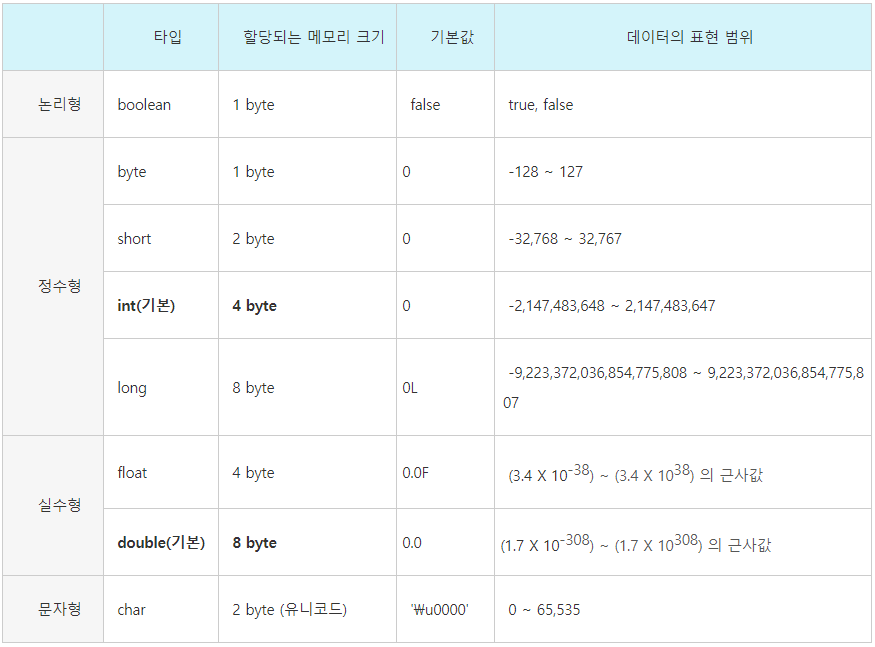

# 자바의 프리미티브 타입, 변수 그리고 배열


#### 학습할 것

[1. 프리미티브 타입 종류와 값의 범위 그리고 기본 값](#프리미티브-타입-종류와-값의-범위-그리고-기본-값)

[2. 프리미티브 타입과 레퍼런스 타입](#프리미티브-타입과-레퍼런스-타입)

[3. 리터럴](#리터럴)

[4. 변수 선언 및 초기화하는 방법](#변수-선언-및-초기화하는-방법)

[5. 변수의 스코프와 라이프타임](#변수의-스코프와-라이프타임)

[6. 타입 변환, 캐스팅 그리고 타입 프로모션](#타입-변환-캐스팅-그리고-타입-프로모션)

[7. 1차 및 2차 배열 선언하기](#1차-및-2차-배열-선언하기)

[8. 타입 추론, var](#타입-추론-var)
  
---


### 프리미티브 타입 종류와 값의 범위 그리고 기본 값
</img>
<br>
출처 : [https://gbsb.tistory.com/6](https://gbsb.tistory.com/6)
<br><br>

---
### 프리미티브 타입과 레퍼런스 타입

+ 기본형 타입(Primitive Type)
```
논리형(boolean),정수형(byte,short,int,long),실수형(float,double),문자형(char)
실제 값을 저장하는 공간으로 스택 메모리에 저장

모두 기본값이 있기 때문에 Null이 존재하지 않는다. 만약 넣고 싶다면 래퍼 클래스(객체)를 활용
논리형(Boolean),정수형(Byte,Short,Integer,Long),실수형(Float,Double),문자형(Charater)
```
+ 참조형 타입(Reference Type)
```
기본형 타입을 제외한 모든 타입
값이 저장되어 있는 곳의 주소값을 저장하는 공간으로 힙 메모리에 저장
빈 객체를 의미하는 Null 존재

배열(Array) , 열거(Enumeration) , 클래스(Class) , 인터페이스(Interface)
```

---
### 리터럴
```
프로그램에서 사용하는 모든 값
리터럴에 해당 되는 값은 특정 메모리 공간(constant pool)에 있음
```
+ 정수 리터럴
```
int a = 15;     // 10진수 리터럴 15
int b = 015;    // 0으로 시작하면 8진수 , 13 출력
int c = 0x15;   // 0x로 시작하면 16진수 , 21 출력
int d = 0b0101; // 0b로 시작하면 2진수 , 5 출력
long e = 26L;   // long 타입 리터럴은 숫자 뒤에 L 붙임
```
+ 실수 리터럴
```
소수점, 지수 형태로 표현
double f = 0.1234;
double g = 1234E-4; // = 1234*10^-4
float h = 0.1234f; // float 타입은 숫자뒤에 f 붙임, double 타입은 d 생략 가능
```
+ 문자 리터럴
```
작은 따옴표 ' ' 로 표현
char a = 'A';
char b = "가";
char c = \uae00; // \u 다음에 4자리 16진수로, 2바이트의 유니코드
```
+ 문자열 리터럴
```
참조형 타입
큰 따옴표 " " 로 표현
String a = "ABCD";
```
+ 논리 리터럴
```
boolean a = true;
boolean b = false;
boolean c = 10>0; // c = true 
```
+ null 리터럴
```
레퍼런스에 대입해서 사용
기본타입에는 사용 불가
String a = null;
```

---
### 변수 선언 및 초기화하는 방법
```
int a;       // 선언

int b;
b = 10;      // 선언 후 초기화

int c = 10;  // 선언과 동시에 초기화
```
+ 변수 선언시 유의점
```
변수의 이름은 알파벳, 숫자 , _ , $로 구성
대소문자 구별
숫자로 시작 X , 키워드(예약어) X , 공백 X
```
+ 상수
```
변하지 않는 값 , 선언 시에 final 키워드를 사용
선언된 상수는 다른 값을 대입할 수 없다.

final int MAX_VALUE = 9999; // 상수는 대문자와 _ 로 작성하자!
```

---
### 변수의 스코프와 라이프타임
변수에는 사용할 수 있는 범위(Scope)가 있음

+ 로컬 변수 (지역 변수)
```
함수(메서드) 내부에 선언하며 함수 밖에서는 사용 불가
함수를 호출하면 스택 메모리에 생성되고 종료되면 스택이 사라지고, 안에 있던 변수 또한 사라짐
```

+ 인스턴스 변수 (멤버 변수)
```
new 키워드로 인스턴스를 생성해야 사용 가능
힙 메모리에 생성되며 해당 클래스의 메서드에서 사용 가능
접근제어자가 public 이면 다른 클래스에서도 사용 가능 (같은 패키지)
Garbage collector에 의해 수거
```

+ 클래스 변수 (스태틱 변수)
```
프로그램 실행시 클래스를 메모리에 로드했을 때부터 생성
인스턴스를 new로 생성하지 않아도 사용 가능
데이터 영역에 생성되며 프로그램 종료시까지 메모리에서 해제되지 않음
```

---
### 타입 변환, 캐스팅 그리고 타입 프로모션

서로 다른 자료형의 값이 대입되는 경우 형 변환이 일어남

+ 자동(묵시적) 타입 변환 ( 업캐스팅 = promotion )
```
개발자가 어떤 작업을 하지 않아도 프로그램이 자동으로 데이터 타입을 변환해줌
데이터의 크기에 따라 발생 -> 작은 크기를 가진 타입이 큰 크기를 가지는 타입에 저장될 때
ex) byte byteType = 5; // 1byte를 
    int intType = byteType; // 4byte에 저장 

* byte(1) < short(2) < int(4) < long(8) < float(4) < double(8)
            char(2)
  => 실수는 정수 타입과는 다른 저장 방식 때문에 정수 타입보다 훨씬 더 많은 범위를 표현할 수 있다.
```

+ 강제(명시적) 타입 변환 ( 다운캐스팅 = casting )
```
데이터 크기가 큰 타입을 작은 타입으로 변환
캐스팅 연산자를 사용해서 변환
ex) int intType = 55;
    byte byteType = (byte)intType;
=> 손실될 값이 없기 때문에 강제 형 변환 가능 ( 55는 00110111 8비트 즉, 1바이트로 나타낼수 있기때문)

ex) int intType = 523;
    byte byteType = (byte)intType;
=> 523이 2바이트로 표현되기 때문에 00000010 00001011 에서 1바이트에 해당되는 값 11이 출력
```

---
### 1차 및 2차 배열 선언하기
+ 1차 배열 선언
```
int[] arr = new int[2];
int[] arr2 = new int[]{1,2,3,4};
int[] arr3 = {1,2,3};
```

+ 2차 배열 선언
```
int[][] arr = new int[1][2];
int[][] arr2= new int[][]{{1,2},{3,4};
int[][] arr3 = {{1,2},{3,4}};
```
+ 기본값
```
byte, short, int, long, float, double -> 0
char -> 공백문자
boolean -> FALSE
참조 자료형 -> null
```

---
### 타입 추론, var
타입추론 - 값을 보고 컴파일러가 데이터 타입이 무엇인지 추론
```
ex) 
HashMap<Integer,String> hashmap = new HashMap<>();
```
var - 로컬 변수이면서 선언과 동시에 값이 할당 되어야 사용 가능
```

```
