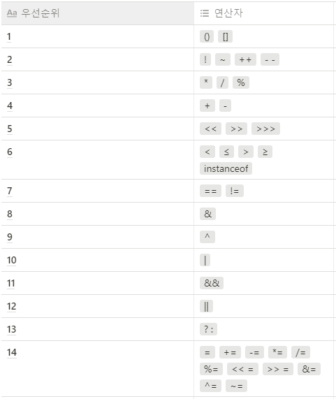

# 자바 연산자


#### 학습할 것

[1. 산술 연산자](#산술-연산자)

[2. 비트 연산자](#비트-연산자)

[3. 관계 연산자](#관계-연산자)

[4. 논리 연산자](#논리-연산자)

[5. instanceof](#instanceof)

[6. assignment(=) operator](#assignment-operator)

[7. 화살표(->) 연산자](#화살표--연산자)

[8. 3항 연산자](#3항-연산자)

[9. 연산자 우선순위](#연산자-우선순위)

[10. Java 13 switch 연산자](#Java-13-switch-연산자)
  
---


### 산술 연산자
```
+(덧셈), -(뺄셈), *(곱셈), /(나눗셈), %(나머지)

우선순위 : 곱셈=나눗셈=나머지 > 덧셈=뺄셈
```

---

### 비트 연산자
```
&(AND - 두 비트 모두 1이면 1, 나머지 0)
|(OR - 하나라도 1이면 1, 나머지 0)
^(XOR - 두 비트가 다르면 1, 두 비트가 같으면 0)
~(NOT - 단항연산자, 모든 비트값의 부호를 반대로)
>>(우측쉬프트 - 정해진 수만큼 비트를 우측으로)
<<(좌측쉬프트 - 정해진 수만큼 비트를 좌측으로)
>>>(부호무시 우측쉬프트 - 새로 생성되는 비트를 무조건 0으로 채움)

ex) 
byte a = 5; // 0000 0101
byte b = 3; // 0000 0011

sout(a & b); // 0000 0001 -> 1 출력
```
---
### 관계 연산자
```
==(같음), !=(같지않음), >(큼), >=(크거나 같음), <(작음), <=(작거나 같음)
```
---
### 논리 연산자
```
&& (AND - 양쪽 값중 모두 true 이면 true , 나머지 false)
|| (OR - 양쪽 값중 하나라도 true 이면 true, 나머지 false)

a && b 피연산자 a가 FALSE 이면 b를 따로 실행하지 않음
a || b 피연산자 a가 TRUE 이면 b를 따로 실행하지 않는다. 

| , & 는 모든 피연산자 실행
```
---
### instanceof

- 참조변수가 참조하고 있는 인스턴스의 실제 타입을 알아보기 위해 사용   
- 좌측에는 참조변수 , 우측에는 타입(클래스명)   
- true 또는 false 반환 ( true -> 참조변수가 검사한 타입으로 형변환이 가능 )
``` java
ex)
class Parent{}
class Child extends Parent{}
class Assignment3{
  
  public static void main(String[] args){
    
    Parent p = new Parent();
    Child c = new Child();
  
    sout("p instanceof Parent :" + (p instance of Parent)); // true
    sout("c instanceof Parent :" + (c instance of Parent)); // true
    sout("p instanceof Child :" + (p instance of Child)); // false
    sout("c instanceof Child :" + (c instance of Child)); // true
  }
}
```

---
### assignment(=) operator
```
대입, 할당 연산자 - 오른쪽값을 왼쪽으로 할당
```

---
### 화살표(->) 연산자

+ 람다식 (15주차에서 계속)
```
익명함수를 지칭, 메서드의 이름과 반환값이 없음

ex)
//일반
int min(int a, int b){
  return a < b ? a : b;
}

//람다식 
(a,b) -> a > b ? a : b //3항 연산자 , a보다 b가 크면 a , 아니면 b
```

---
### 3항 연산자
```
항이 3개 존재하는 연산자
조건 ? true 값 : false 값
```

---
### 연산자 우선순위

</img><br><br>


---
### Java 13 switch 연산자

Java 13의 주요기능( TODO... )
+ Dynamic CDS Archives
```
```

+ ZGC: Uncommit Unused Memory
```
```

+ Reimplement the Legacy Socket API
```
```

+ Switch Expressions
    - Arrow
  ```
  : 대신 -> 를 사용 가능
  ex) 
  static void arrowLabel(int k){
    switch(k){
      case 1 -> sout("one"); // arrowLabel(1); 
      case 2 -> sout("two"); // arrowLabel(2);
      default -> sout("zero"); 
    }
  }  
  ```

    - Yield
  ```
  yield 키워드 추가 ( 기존 break 대신 사용 ) 
  ```

    - Expression
  ```
  switch를 식으로 사용
  ex)
  sout(
    switch(k) {
      case 1 -> "one"
      case 2 -> "two"
      default -> "zero"
    }
  };
  ```

+ Text Blocks
```
```
