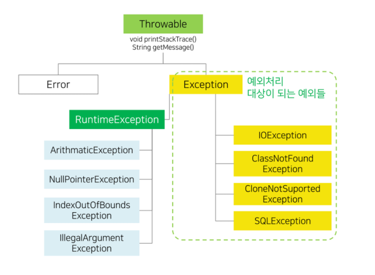

# 자바 예외 처리


#### 학습할 것

[1. 예외 처리 방법](#예외-처리-방법)

[2. 자바가 제공하는 예외 계층 구조](#자바가-제공하는-예외-계층-구조)

[3. Exception과 Error의 차이는?](#Exception과-Error의-차이는)

[4. RuntimeException과 RE가 아닌 것의 차이는?](#RuntimeException과-RE가-아닌-것의-차이는)

[5. 커스텀한 예외 만드는 방법](#커스텀한-예외-만드는-방법)


---
### 예외 처리 방법
1. 예외 처리(Exception Handling) 란?
    - 프로그램이 처리되는 동안 특정한 문제가 일어났을 때 처리를 중단하고 다른 처리를 하는 것   
    
2. 예외 처리 방법
    1. try , catch , finally(옵션)
        - try : 실제 코드가 들어가는 곳(예외가 발생할 가능성이 있는 코드)
        - catch : 예외 발생 시 처리할 코드, 여러개 사용 시에 자식클래스를 먼저 작성
        - finally : 예외처리와 상관없이 무조건 수행되는 코드
        - 실행순서
            + 예외 발생 : try -> catch -> finally
            + 예외 미발생 : try -> finally   
    
    2. throw(사용자 예외 발생)
        - 개발자의 의도대로 예외를 발생시키는 것
        - throw 키워드를 사용하여 발생시킬 예외 클래스의 객체지정
    
    3. throws(예외 처리 위임)
        - 자신이 예외를 직접 처리하지 않고, 메서드를 호출한 곳으로 위임할 때 사용
        - 예외를 위임받은 메서드는 자신이 직접 처리하거나 또 다른곳으로 위임 가능
```java
public class assignment9 {
    public static void main(String[] args) {

        System.out.println(1); //정상 실행
        int[] number = {1,2,3};

        try {
            System.out.println(number[3]); //예외발생 -> catch구문으로 이동
            System.out.println(number[1]/0); //실행되지않음
        } catch (ArrayIndexOutOfBoundsException e){//자식먼저
            System.out.println("ArrayIndexOutOfBoundsException" + e.getMessage()); //어떤에런지 메시지
            e.printStackTrace(); //에러 정보 전달
        } catch (ArithmeticException e) {//자식
            System.out.println("ArithmeticException");
        } catch (Exception e){ //부모
            System.out.println("Exception");
        }
        finally {
            System.out.println(3); //무조건 실행
        }
    }
}
```
    
---
### 자바가 제공하는 예외 계층 구조
</img>
<br>
출처 : [https://close852.tistory.com/47](https://close852.tistory.com/47)
<br><br>

---
### Exception과 Error의 차이는?
1. Exception
    - 실행시에 발생하는 비정상적인 조건
    - ex) 파일 읽기시 파일이 없음, 0으로 나누기(ArithmeticException)
2. Error
    - 자바 어플리케이션의 동작 환경에서 어떤 문제가 생긴 것
    - ex) 메모리 부족, 운영체제 문제

---
### RuntimeException과 RE가 아닌 것의 차이는?
1. Checked Exception(Exception) (컴파일러가 체크하는 예외)
    - 컴파일 시점에 발생하는 예외, 개발자가 코딩시 예외처리 필수
    - 주로 프로그램의 사용자들의 동작에 의해서 발생
    - 존재하지 않는 파일 처리(FileNotFoundException)
    - 잘못된 데이터 형식(DataFormatException) ...   
    

2. Unchecked Exception(Runtime Exception) 
    - 프로그램 실행시에 발생하는 예외, 발생할 것을 미리 알 수 없음(개발자의 경험)
    - 배열범위 벗어남(IndexOutOfBoundsException)
    - null인 참조변수의 멤버를 호출(NullPointerException)
    - 클래스간의 잘못된 형변환(ClassCastException)
    - 정수를 0으로 나누기(ArithmeticException) ...
---
### 커스텀한 예외 만드는 방법
